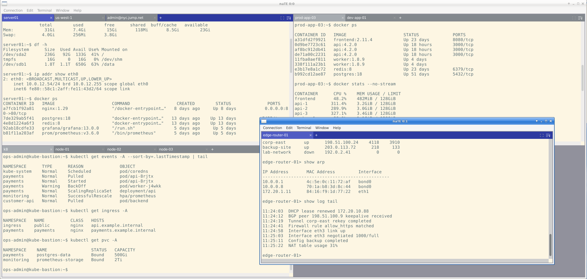

# naTE

**not another Terminal Emulator — tiling layouts, SSH, and serial support.**

[](https://github.com/lhovind/naTE/actions/workflows/ci.yml)
[](LICENSE.md)
-lightgrey)



---

## What is naTE?

naTE (*not another Terminal Emulator*) is a graphical terminal emulator built for people who live in SSH sessions. It
gives you a tiling, tabbed interface where multiple terminals share a single window,
remembers your sessions across restarts so you can pick up exactly where you left
off, and ships with a full suite of SSH features — agent forwarding, X11 forwarding,
ProxyJump, keyboard-interactive (MFA) auth, and SFTP file transfer — all without
touching the command line.

If you manage remote servers, work with serial consoles, or just want a terminal that
treats sessions as first-class objects rather than throwaway windows, naTE is built
for you.

---

## Features

### Terminal emulation
- VT100 / ANSI escape sequences, SGR attributes, OSC sequences
- UTF-8 text rendering with wide/CJK character support — double-width characters occupy two terminal cells; non-ASCII glyphs are drawn individually to prevent font-fallback advance drift (combining characters are not yet supported)
- Configurable scrollback buffer (default 100,000 lines)
- Alternate screen support (vim, htop, tmux) — also manually toggled via the alt-screen button in the tile title bar
- **Wrap mode and viewport width** — in a classic terminal the shell's reported width equals the window width, so any output beyond that column is silently truncated and lost. naTE decouples these: you can set a **column width** (what the shell believes the terminal is, e.g. 220 columns) independently of the visible tile width. Long lines are captured in full rather than discarded. The wrap button in the tile title bar then controls how those lines are presented — wrap on reflows them into the visible area; wrap off lets the viewport scroll horizontally so each line stays on one row. Per-connection column-width overrides are available in the connection profile.
- Bracketed paste with optional confirmation dialog
- URL detection and click-to-open
- **Mouse selection** — click-drag to select; double-click selects the word under the cursor (word boundary pattern is a configurable regex); triple-click selects the full line
- **Find in Terminal** (`Ctrl+Shift+F` / **Edit → Find in Terminal**) — case-insensitive search across the full scrollback buffer; all matches are highlighted and the current match is distinguished; navigate with `Enter` / `F3` (forward) and `Shift+F3` (back); pre-populates from the active selection

### Tiling & tabs
- Each window holds one or more **tiles** arranged in a grid; each tile has its own tab strip
- Open new tabs in the active tile via **Connection → New Connection in Tab**
- Move a session to its own tile in the same window with **Terminal → Move to New Tile**
- Move a session or tile to a separate window with **Terminal → Move to New Window**
- Open a blank second window from **Window → New Window**
- **Tile layout direction** (horizontal or vertical) is set per-window via **Window → Tile Layout**, with a global default in **Edit → Preferences → Appearance**
- Drag a **tab** to reorder it within the same tile, move it to a different tile, or drop it onto another window
- Drag the **tile header** (blank area to the right of the `+` button) to move all sessions in that tile to another window
- Broadcast mode — send the same input to multiple sessions simultaneously

### Session management
- Auto-save and restore open sessions on launch
- Named workspaces ("Save Workspace As...")
- Reconnect bar when a connection drops — resume without re-entering credentials
- Confirm-close protection — a dialog warns before closing a window with active sessions; auto-suppressed for single-session close; configurable via **Edit → Preferences → Behavior** or a "Don't ask again" option in the dialog itself

### SSH
- Authentication: password, public key, SSH agent, keyboard-interactive (MFA — Duo, YubiKey, PAM)
- SSH agent forwarding (`-A`)
- X11 forwarding (configured per connection profile; Xauthority cookie generated automatically)
- ProxyJump / bastion hop (single hop, auto-detected from `~/.ssh/config`)
- Auto-populate from `~/.ssh/config` — hosts, identity files, ProxyJump rules
- SSH agent identity hints for multi-key setups
- Keepalive and optional compression
- Working-directory tracking — shells that emit OSC 7 (`file://host/path`) update the tracked CWD continuously; a `pwd` subchannel captures the final CWD at disconnect for session-restore accuracy

### Session initialization
- Per-connection **working directory** — set the initial directory for PTY and SSH sessions
- Per-connection **environment variables** — define key/value pairs in the connection profile, merged on top of the parent environment
- **Environment file** — point to a `.env`-style file; variables are loaded and merged at session start
- **Login shell** — opt in to a login-shell invocation for PTY and SSH sessions
- **Profile title** — give a connection profile a fixed tab title that overrides the dynamic hostname/command title
- App-wide defaults for working directory, login shell, and env file in **Edit → Preferences → Session**; per-profile overrides take precedence

### Serial
- Configurable baud rate, data bits, stop bits, parity, and flow control
- Optional dial script executed before I/O (for modem-style connections)

### File transfer
- SFTP send and receive via the existing authenticated session (no re-authentication)
- Remote directory browser with alphabetical listing
- **Edit remote file** — open a remote file in your local editor (**Terminal → Edit Remote File**); naTE downloads it to a temp path, watches for saves via inotify, and re-uploads automatically on each write. Supports direct-save editors (vim, nano) and atomic-rename editors (VSCode, gedit). Configure the editor command in **Edit → Preferences → Behavior** or via the `$EDITOR` environment variable.

### Appearance
- Built-in themes: Solarized Dark, Solarized Light, xterm
- Custom themes: drop a base16 `.yaml` file or a naTE `.ini` file in `~/.nate/themes/`
- Font family and size picker (monospace fonts only)
- Cursor styles: Block, Bar, Underline — with optional blink
- Bell modes: None, Visual (screen flash), Audible
- Configurable cell padding

### Connection manager
- Save connection profiles (SSH, serial, local shell) with per-profile settings
- Per-profile word-wrap and column-width overrides (override the global defaults for specific hosts or devices)

---

## Installation

### Linux — AppImage (recommended)

Download the latest `naTE-x86_64.AppImage` from the
[Releases page](https://github.com/lhovind/naTE/releases), then:

```bash
chmod +x naTE-x86_64.AppImage
./naTE-x86_64.AppImage
```

No installation required. The AppImage bundles all dependencies.

### Build from source

#### Prerequisites

| Dependency | Version | Notes |
|---|---|---|
| CMake | ≥ 3.20 | |
| Ninja | any | `ninja-build` on Debian/Ubuntu |
| GCC or Clang | C++20 | |
| GTK 3 dev headers | any | Linux only — `libgtk-3-dev` |
| OpenSSL dev headers | any | `libssl-dev` |
| pkg-config | any | Linux only |

wxWidgets, libssh2, and nlohmann/json are fetched automatically by CMake at
configure time — you do not need to install them separately.

#### Steps

```bash
git clone https://github.com/lhovind/naTE.git
cd naTE

cmake --preset release
cmake --build build-release --parallel $(nproc)

./build-release/naTE
```

**macOS note:** GTK 3 is not required on macOS; wxWidgets uses the native Cocoa
backend. macOS support is currently **experimental** — there is no CI coverage and
some features may behave differently.

---

## Quick Start

1. Launch naTE.
2. Open **File → New Connection** (or `Ctrl+N`).
3. Choose a transport tab: **SSH**, **Serial**, or **Local Shell**.
4. For SSH: enter the host, username, and authentication method, then click **Connect**.
5. To open more sessions, use **Connection → New Connection in Tab** to add a tab to
   the active tile, or **Terminal → Move to New Tile** to give a session its own tile
   in the same window. Open a second window any time with **Window → New Window**.
   You can also drag a tab between tiles or onto another window, and drag the blank
   area of a tile header to move the entire tile to a different window.
6. Save your workspace for next time: **Connection → Save Workspace As...**

On the next launch, naTE restores your last workspace automatically. Named workspaces
let you save and switch between multiple layouts.

---

## Configuration

### config.ini

`config.ini` (in the same directory as the binary, or `~/.nate/config.ini`) controls
defaults for appearance, behavior, and terminal settings. Open
**Edit → Preferences** for a GUI over the most common options — changes take effect
immediately in open sessions.

### User data directory — `~/.nate/`

| Path | Contents |
|---|---|
| `~/.nate/connections.json` | Saved connection profiles |
| `~/.nate/workspaces/` | Named workspaces |
| `~/.nate/themes/` | Custom color themes |

### Custom themes

naTE supports two theme file formats, both scanned from `~/.nate/themes/` at startup.

#### base16 YAML (recommended)

The easiest way to get new themes is to download them directly from the
[tinted-theming/base16-schemes](https://github.com/tinted-theming/base16-schemes)
repository, which hosts 250+ community-maintained palettes (Gruvbox, Nord, One Dark,
Tokyo Night, Dracula, and many more):

```bash
# download a single theme
curl -o ~/.nate/themes/gruvbox-dark.yaml \
  https://raw.githubusercontent.com/tinted-theming/base16-schemes/main/gruvbox-dark.yaml

# or clone the whole collection
git clone https://github.com/tinted-theming/base16-schemes ~/.nate/themes/base16-schemes
```

Both the flat v0.x format (`scheme: "Name"` / `base00: "rrggbb"` at top level) and the
nested v2 format (`name: "Name"` / `palette:` block) are supported. Restart naTE after
adding files; the new themes appear in **Edit → Preferences → Appearance** sorted
alphabetically.

#### naTE INI format

For themes that need independent regular and bright color variants (like the built-in
xterm theme), naTE uses its own `.ini` format with either a `[Palette]` section
(base16-style hex values) or an `[ANSI]` section (direct 0–15 index table). Copy a
built-in theme as a starting point:

```bash
cp themes/solarized-dark.ini ~/.nate/themes/my-theme.ini
# edit my-theme.ini, then select it in Edit → Preferences → Appearance
```

The `[Palette]` section uses the same `base00`–`base0F` key names as base16 YAML, so
converting between the two formats is a straightforward find-and-replace.

---

## Development

### Building for development

```bash
cmake --preset debug
cmake --build build --parallel $(nproc)
./build/naTE
```

The `debug` preset enables symbols and disables optimisations. The `release` preset
enables LTO.

### Running the test suite

```bash
cmake --preset debug
cmake --build build --target naTE_tests --parallel $(nproc)
ctest --preset debug
```

Tests are written with [Catch2](https://github.com/catchorg/Catch2). The suite
currently covers 312 scenarios across all major subsystems.

### Packaging (AppImage)

```bash
./scripts/build-appimage.sh
# produces naTE-x86_64.AppImage in the project root
```

### Architecture

naTE follows a ports-and-adapters layout. The core — terminal parsing (`src/parser/`),
document model (`src/document/`), session management (`src/session/`), and transport
backends (`src/transport/`) — is entirely headless and has no dependency on wxWidgets.
The wxWidgets UI (`src/ui/`) is one implementation of the presentation layer and is,
in principle, swappable for another frontend without touching the core. Persistence
uses a thin JSON repository layer (`src/db/`) so the storage format can change
without touching business logic.

---

## Roadmap

### Planned

- **Local port forwarding (`-L`)** — forward a local port through an SSH connection
- **Remote port forwarding (`-R`)** — expose a local port on the remote host


---

## Contributing

See [CONTRIBUTING.md](CONTRIBUTING.md) *(coming soon)* for guidelines on submitting
issues and pull requests.


---

## License

GPL v3 — see [LICENSE](LICENSE.md).
